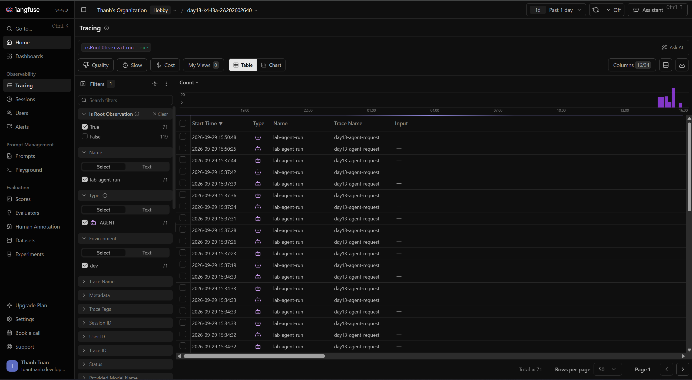
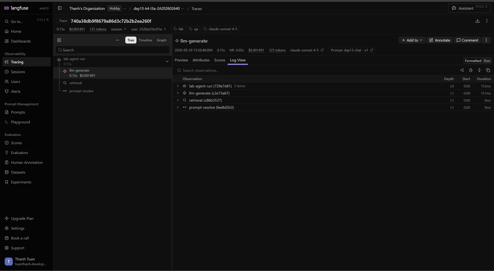
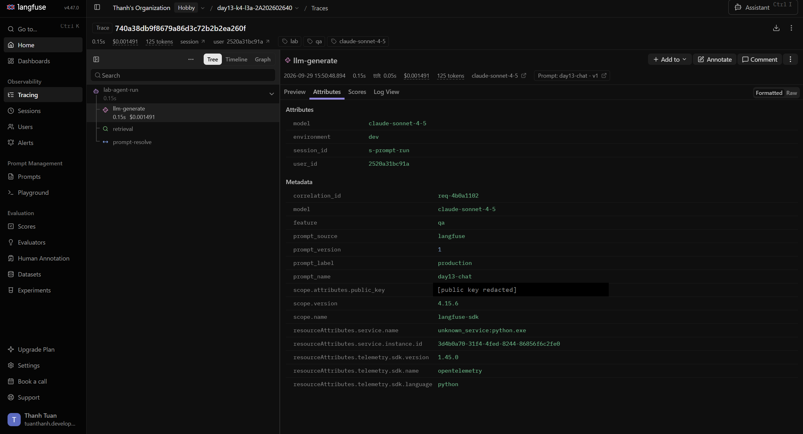
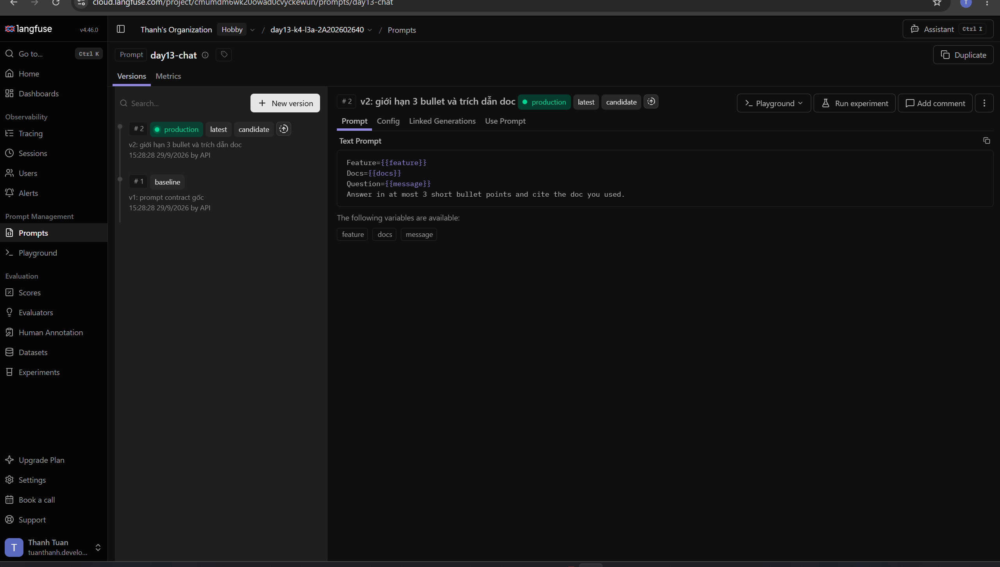
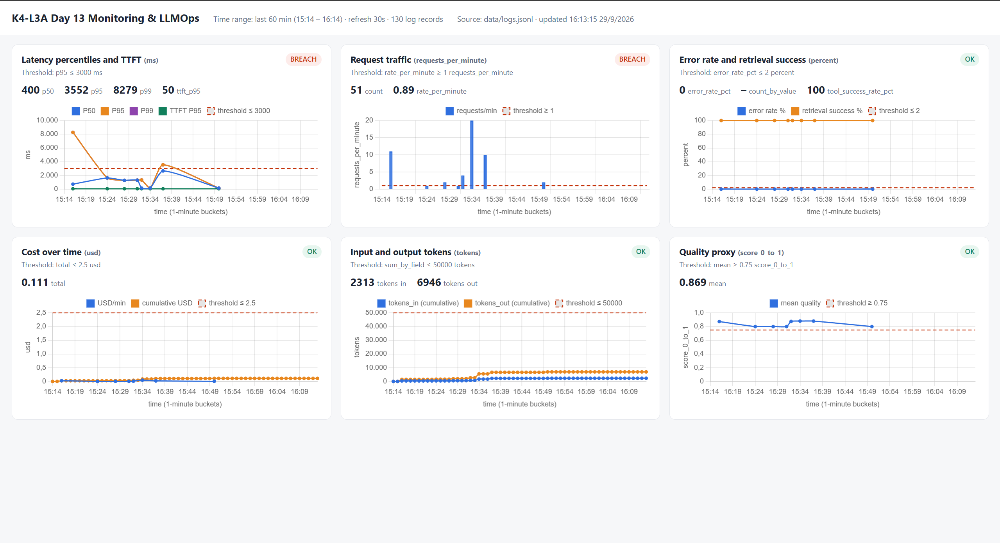

# Báo cáo cá nhân — K4-L3A Day 13 Monitoring & LLMOps

> Mỗi học viên hoàn thiện một file duy nhất này. Khi dẫn evidence, dùng đường dẫn tương đối, ví dụ `evidence/07-trace-waterfall.png`.

## 1. Thông tin học viên

- **Họ và tên:** Nguyễn Tuấn Thành
- **MSSV:** 2A202602640
- **Lớp:** K4-L3A
- **Repository URL:** https://github.com/Chika1357/K4-L3-DAY13-NguyenTuanThanh-2A202602640-Monitoring-LLMOps
- **Commit SHA cuối:**
- **Challenge ID:**
- **Tên project Langfuse cá nhân:** `day13-k4-l3a-2A202602640`

## 2. Evidence index

Điền đúng đường dẫn tới evidence thực tế. Có thể đổi tên hoặc dùng nhiều ảnh nếu cần.

| Evidence | Đường dẫn |
|---|---|
| Baseline CP0 (trước khi sửa) | [`evidence/00-baseline-pytest.txt`](evidence/00-baseline-pytest.txt), [`evidence/00-baseline-validators.txt`](evidence/00-baseline-validators.txt) |
| Pytest cuối | [`evidence/01-pytest.txt`](evidence/01-pytest.txt) |
| Log validator | [`evidence/02-log-validator.txt`](evidence/02-log-validator.txt) |
| Dashboard validator | [`evidence/03-dashboard-validator.txt`](evidence/03-dashboard-validator.txt) |
| Structured log | [`evidence/04-structured-log.txt`](evidence/04-structured-log.txt) |
| PII redaction | [`evidence/05-pii-redaction.txt`](evidence/05-pii-redaction.txt) |
| Trace list |  71 root traces (`isRootObservation:true`); danh sách trace ID + waterfall text: [`evidence/06-trace-ids.txt`](evidence/06-trace-ids.txt) |
| Trace waterfall |  trace `740a38db9f8679a86d3c72b2b2ea260f` (`req-4b0a1102`); bản text: [`evidence/07-trace-waterfall.txt`](evidence/07-trace-waterfall.txt) |
| Trace metadata |  `correlation_id=req-4b0a1102`, prompt `day13-chat` v1 / `production`, model, token, cost (đã che public key); bảng giá model Langfuse khớp công thức cost ($3/$15 per 1M token): [`evidence/08b-model-pricing.png`](evidence/08b-model-pricing.png) |
| Prompt versions |  [`evidence/09-prompt-versions.png`](evidence/09-prompt-versions.png); bản text: [`evidence/09-prompt-versions.txt`](evidence/09-prompt-versions.txt) |
| Prompt rollback | Trước (production = v2): [`evidence/10-prompt-rollback-before.png`](evidence/10-prompt-rollback-before.png) — Sau (production = v1): [`evidence/10-prompt-rollback-after.png`](evidence/10-prompt-rollback-after.png) |
| Dashboard runtime |  |
| Practice `rag_slow` (không phải challenge) | [`evidence/practice-rag-slow.txt`](evidence/practice-rag-slow.txt) |
| Incident metric | `evidence/12-incident-metric.png` |
| Incident log | `evidence/13-incident-log.png` |
| Incident trace | `evidence/14-incident-trace.png` |

## 3. Kết quả kỹ thuật

| Nội dung | Baseline | Kết quả cuối | Nhận xét |
|---|---|---|---|
| `validate_logs.py` | 30/100 (41 records; 40 thiếu required fields/enrichment; 0 unique correlation ID) | CP2: 100/100 (CP1: 100/100, 22 records) | Baseline: correlation ID = `MISSING`, chưa bind context. Sau CP1 đo trên file log mới (log baseline lưu riêng ở `data/logs.baseline.jsonl`, không commit) |
| `validate_dashboard.py` | HỢP LỆ 6/6 panel (contract) | CP2: HỢP LỆ 6/6 + dashboard runtime tại `/dashboard` | Baseline chỉ có contract YAML; CP2 thêm dashboard đọc `data/logs.jsonl` theo đúng contract |
| `pytest` | 22 passed | CP2: 41 passed (CP1: 35) | CP1: test PII và correlation/enrichment/không rò context. CP2: test child observations (retrieval/prompt/generation, usage, cost, không PII, retrieval lỗi → `level=ERROR`) và test dashboard |
| Số traces hợp lệ | 20 root traces (chưa có child observation) | CP2: 38 traces có đủ root + `retrieval` + `prompt-resolve` + `llm-generate` | Tất cả trong project `day13-k4-l3a-2A202602640`, do workload của tôi tạo |
| Số PII leak | 0 (theo validator) | CP1: 0 | Baseline 0 chỉ vì `summarize_text` tự scrub `payload`; scrubber chưa được đăng ký vào pipeline log |
| Latency P95 / TTFT P95 | 1164 ms / 50 ms (P50 448 ms, P99 1481 ms; 20 requests) | CP2 steady state: 152 ms / 50 ms (20 requests, 08:34Z) | Baseline chậm vì prompt `day13-chat` chưa tồn tại → mỗi request fetch Langfuse thất bại (~1–1.5 s) rồi fallback local. Sau khi tạo prompt, SDK cache 60 s nên fetch ~0 ms |
| Retrieval success rate | 100% (20/20) | CP2: 100% | |

## 4. Logging và PII

- **Cách tạo/nhận và truyền correlation ID:** `CorrelationIdMiddleware` (`app/middleware.py`) gọi `clear_contextvars()` đầu mỗi request để không rò context của request trước. Nếu client gửi `x-request-id` hợp lệ (chỉ gồm `[A-Za-z0-9._-]`, tối đa 64 ký tự) thì dùng lại; nếu thiếu hoặc không an toàn (có xuống dòng, khoảng trắng, quá dài → chống log injection) thì sinh `req-<8 hex>` từ `uuid4`. ID được `bind_contextvars` nên mọi log trong request tự có `correlation_id`, được lưu vào `request.state` để truyền vào `LabAgent.run` (đưa vào trace metadata), và trả lại qua header `x-request-id` cùng `x-response-time-ms`. Ví dụ: gửi `x-request-id: req-cafe1234` → response header và body đều trả `req-cafe1234`.
- **Các metadata được ghi vào structured log:** `ts` (ISO UTC), `level`, `service`, `event`, `correlation_id`, và context bind trong `/chat` trước log `request_received`: `user_id_hash` (SHA-256 cắt 12 ký tự, không ghi `user_id` thô), `session_id`, `feature`, `model`, `env`. Event `response_sent` có thêm `latency_ms`, `ttft_ms`, `tokens_in`, `tokens_out`, `cost_usd`, `quality_score`, `tool_name`, `tool_success` — đây là nguồn cho dashboard.
- **Cách bảo đảm PII được scrub trước khi ghi:** processor `scrub_event` được đăng ký trong `structlog.configure` ngay sau `format_exc_info` và **trước** `JsonlFileProcessor`/`JSONRenderer`, nên dữ liệu được che trước khi serialize hoặc ghi file. `scrub_event` duyệt đệ quy mọi field chuỗi (payload lồng nhau, context vars, text exception), chỉ bỏ qua các field do hệ thống sinh (`ts`, `level`, `correlation_id`, `user_id_hash` — tránh trường hợp hash toàn chữ số bị nhận nhầm là CCCD). `app/pii.py` có pattern email, thẻ thanh toán, CCCD (12 số), SĐT Việt Nam (`0`/`+84`, có dấu cách/chấm/gạch) và hộ chiếu (`[A-Z]\d{7}`); thẻ/CCCD được xử lý trước SĐT để một đoạn số thẻ không bị gán nhầm là SĐT.
- **Cách kiểm chứng kết quả:** (1) `validate_logs.py` đạt 100/100 trên log mới, 0 PII leak ([`evidence/02-log-validator.txt`](evidence/02-log-validator.txt)); (2) gửi request có PII giả (email, SĐT, CCCD) và chạy workload mẫu (email, SĐT, thẻ) rồi `grep` từng giá trị thô trong `data/logs.jsonl` → 0 kết quả, chỉ còn nhãn `[REDACTED_*]` ([`evidence/05-pii-redaction.txt`](evidence/05-pii-redaction.txt)); (3) test tự động trong `tests/test_pii.py` và `tests/test_correlation_logging.py` kiểm tra format ID, header, propagate ID của client, enrichment, context không rò giữa hai request liên tiếp và PII không có trong file log.

## 5. Tracing và prompt versioning

- **Cách xác nhận traces do chính tôi tạo trong project cá nhân:** key trong `.env` (không commit) thuộc project `day13-k4-l3a-2A202602640`. Mọi trace do tôi chạy `load_test.py`, `prompt_versions.py run` hoặc `curl` tạo ra; mỗi trace có `correlation_id` trùng với một dòng trong `data/logs.jsonl` của tôi. `scripts/find_trace.py` tra ngược từ `correlation_id` trong log sang trace ID qua Langfuse API ([`evidence/06-trace-ids.txt`](evidence/06-trace-ids.txt): 12 trace, mỗi trace kèm waterfall).
- **Cấu trúc root/retrieval/generation observations:** root `lab-agent-run` (type `agent`, `@observe`, không capture input/output thô) có 3 con tạo bằng `start_as_current_observation` của SDK v4 (`app/tracing.py::start_observation`):
  1. `retrieval` (type `retriever`): input là `query_preview` đã scrub, output `doc_count` + preview docs; khi vector store lỗi thì `level=ERROR` + `status_message`.
  2. `prompt-resolve` (type `span`): thời gian fetch prompt từ Langfuse, output `version/source`, `level=WARNING` khi fallback. Tôi thêm span này sau khi thấy root 1626 ms nhưng hai span con chỉ 151 ms — 1.47 s "biến mất" chính là fetch prompt.
  3. `llm-generate` (type `generation`): `model=claude-sonnet-4-5`, `prompt=<managed prompt>` (link tới version trong Langfuse), `usage_details {input, output, total}`, `cost_details {input, output, total}` theo giá $3/$15 per 1M token, `completion_start_time` = start + TTFT; input/output đi qua `scrub_text`.
- **Cách nối trace với log:** middleware sinh/nhận `correlation_id` → bind vào log context → truyền vào `LabAgent.run` → `propagate_attributes(metadata={"correlation_id": ...})` nên root và mọi observation con đều có metadata `correlation_id`. Trên Langfuse UI: filter Metadata `correlation_id = req-xxxxxxxx`; bằng CLI: `python scripts/find_trace.py req-xxxxxxxx`. Tôi **không** ghi `trace_id` vào log (xem mục 8).
- **Prompt name:** `day13-chat` (text prompt, giữ 3 biến `{{feature}}`, `{{docs}}`, `{{message}}`), tạo bằng `python scripts/prompt_versions.py create`.
- **Version/label baseline:** v1 — labels `baseline` (+ `production` ban đầu); template contract gốc.
- **Version/label candidate:** v2 — label `candidate`; thêm dòng `Answer in at most 3 short bullet points and cite the doc you used.` (tokens_in tăng 32 → 49 với cùng input).
- **Trace ID của mỗi version:** cùng input `Explain why metrics traces and logs work together` ([`evidence/07-trace-waterfall.txt`](evidence/07-trace-waterfall.txt)):
  - label `baseline` → v1: `req-7c4fc12a` → trace `951c49ac7800d75caddfa7cbb36c89b2`
  - label `candidate` → v2: `req-55203e89` → trace `d9e4c07a9962b3e946971ce880bb06fe`
  - label `production` sau khi promote v2: `req-9d0c0002` → trace `78a2d8de83cd7fa3fba5c4fd40526315` (generation gắn `day13-chat v2`)
  - label `production` sau khi rollback về v1 (thao tác trên UI Langfuse): request đầu `req-4b0a1101` → trace `2b14287c583d12a1db31bd53961e3798` vẫn dùng v2; request kế tiếp `req-4b0a1102` → trace `740a38db9f8679a86d3c72b2b2ea260f` dùng **v1** (tokens_in 49 → 32)
- **Cách promote và rollback `production`:** label trong Langfuse là duy nhất trong một prompt, gán `production` cho version nào thì version cũ tự mất label. Promote: `python scripts/prompt_versions.py set-production 2` (hoặc UI: Prompts → `day13-chat` → v2 → Labels → thêm `production`). Rollback: gán lại `production` cho v1. App không cần deploy lại — `resolve_prompt` fetch theo label. SDK cache 60 s theo kiểu stale-while-revalidate: khi cache hết hạn, request đầu tiên vẫn nhận version cũ trong lúc SDK refresh nền, request sau mới nhận version mới (đúng như `req-4b0a1101` → v2, `req-4b0a1102` → v1). Vì vậy khi rollback khẩn cấp cần kiểm tra trace của request **sau** thời điểm đổi label, không kết luận từ request đầu tiên; nếu Langfuse lỗi app fallback template local và trace ghi `prompt_source=local-fallback`.

## 6. Dashboard, SLO và alerts

- **Dashboard và sáu panel:** endpoint `GET /dashboard` trong chính FastAPI app (`app/dashboard.py`), đọc `data/logs.jsonl` mỗi lần tải và đọc title/unit/threshold/time range/refresh từ `config/dashboard.yaml` (không hard-code, không lệch contract). Time range 60 phút theo bucket 1 phút, auto refresh 30 s, mỗi panel có đơn vị, giá trị tổng hợp, badge OK/BREACH và đường threshold (đỏ, nét đứt): (1) Latency P50/P95/P99 + TTFT P95, ngưỡng P95 ≤ 3000 ms; (2) Traffic request/phút, ngưỡng ≥ 1; (3) Error rate %, breakdown `error_type` và retrieval success %, ngưỡng ≤ 2%; (4) Cost USD/phút + lũy kế, ngưỡng tổng ≤ 2.5 USD; (5) Tokens in/out lũy kế, ngưỡng ≤ 50,000; (6) Quality mean, ngưỡng ≥ 0.75. Token và cost vẽ lũy kế vì threshold là tổng cả cửa sổ. `GET /dashboard/data` trả JSON cùng số liệu. Kiểm tra runtime bằng practice `rag_slow`: P95 phút 08:37 tăng lên 3552 ms, panel chuyển BREACH ([`evidence/practice-rag-slow.txt`](evidence/practice-rag-slow.txt)). Ảnh [`evidence/11-dashboard-overview.png`](evidence/11-dashboard-overview.png) (15:14–16:14 giờ VN) có 2 panel BREACH và đều là dữ liệu thật, không chỉnh để ảnh đẹp: Latency (P95 3552 ms, P99 8279 ms) do các request cold start lúc 15:16 — trước khi prompt tồn tại — và đợt practice `rag_slow` lúc 15:37; Traffic (0.89 req/phút < 1) vì sau 15:50 không còn workload, đúng là tình huống ngưỡng traffic tối thiểu được đặt ra để phát hiện.
- **SLO và lý do chọn:** giữ `fast_successful_requests` 99.5% trong 28 ngày, request tốt = `response_sent` và `latency_ms ≤ 3000`. Baseline P99 1481 ms nên 3000 ms là ~2× P99 — không báo giả vì dao động thường nhưng bắt được `rag_slow` (+2.5 s). Request lỗi cũng tính là xấu vì mẫu số là `request_received`. Chi tiết trong `config/slo.yaml`.
- **Cách tính error budget:** budget = (1 − 0.995) × tổng request trong 28 ngày. Ví dụ 1 request/phút → 40,320 request → tối đa ~201 request chậm/lỗi. Burn rate = (tỉ lệ xấu trong cửa sổ) / 0.005; burn rate 14.4 kéo dài 1 giờ tiêu ~2.1% budget và làm cạn budget sau ~1.9 ngày. Policy: còn > 50% budget thì đổi prompt/deploy bình thường; 10–50% chỉ đổi khi có rollback plan; < 10% thì freeze thay đổi.
- **Ba alert và runbook tương ứng:** (`config/alert_rules.yaml`, runbook trong `docs/alerts.md`) — owner Nguyễn Tuấn Thành
  1. `chat_latency_p95_high` — P2, P95 > 3000 ms trong 5m, Slack `#day13-l3a-oncall` (bắt `rag_slow`).
  2. `chat_error_rate_high` — P1, error rate > 2% trong 5m, Slack `#day13-l3a-oncall` (bắt `tool_fail`).
  3. `llm_cost_per_request_spike` — P3, cost trung bình/request > 0.005 USD (~2× baseline 0.0023) trong 15m, Slack `#day13-l3a-llm-cost` (bắt `cost_spike`).

## 7. Điều tra challenge

- **Challenge ID:**
- **Khoảng thời gian điều tra:**
- **Triệu chứng từ metrics:**
- **Log line và correlation ID liên quan:**
- **Trace ID và span gây ảnh hưởng:**
- **Root cause:**
- **Fix action:**
- **Preventive measure:**

## 8. Giải thích và tự đánh giá

- **Một quyết định kỹ thuật quan trọng và lý do:** không ghi Langfuse `trace_id` vào structured log, chỉ nối log ↔ trace qua `correlation_id` trong trace metadata. Ban đầu tôi có log `trace_id` cho tiện, nhưng thấy trace ID của request `req-3d6a91e5` bị scrubber sửa thành `cdc2bd6c7454c[REDACTED_PHONE_VN]c62a14ede` — chuỗi hex có đoạn `0` + 9 chữ số liền nhau, trùng regex SĐT. Nếu loại trừ field này khỏi scrubber thì `validate_logs.py` (quét regex trên toàn dòng log thô) vẫn sẽ tính đó là PII leak; xác suất ~0.3%/trace nên với vài trăm request ở CP3 gần như chắc chắn xảy ra. Vì vậy tôi bỏ `trace_id` khỏi log và viết `scripts/find_trace.py` tra trace theo metadata `correlation_id` qua Langfuse API. Tương tự, tôi dựng dashboard ngay trong app thay vì Grafana/Streamlit để không thêm dependency và đọc thẳng contract YAML.
- **Một lỗi/blocker đã gặp:** (1) CP0: `python -m pytest -q` báo `ModuleNotFoundError: No module named 'structlog'`/`'langfuse'`. (2) CP1: regex thẻ ban đầu `\d{4}[- ]?\d{4}[- ]?\d{4}[- ]?\d{4}` khớp nhầm khi CCCD đứng ngay trước số thẻ (`001203004567 4111 1111 1111 1111` → khớp `001203004567 4111`), để lộ `1111 1111 1111` của số thẻ trong log — validator không phát hiện vì chuỗi này có dấu cách.
- **Cách tìm nguyên nhân và xử lý:** (1) Traceback cho thấy đang dùng Python toàn cục (`...\Python311\Lib`) thay vì `.venv`; kích hoạt `.\.venv\Scripts\Activate.ps1` ở terminal chạy test là hết lỗi. (2) Test tích hợp gửi nhiều loại PII trong một message đã fail và in ra `message_preview` còn sót số; sửa regex thẻ để bắt buộc cùng một loại ngăn cách giữa các nhóm (`(?P<sep>[- ]?)` + `(?P=sep)`) và thêm test hồi quy `test_scrub_adjacent_cccd_and_card_leaves_no_digits`.
- **Cách hiểu luồng Metrics → Logs → Traces:**
- **Vai trò của prompt version, token/cost, SLO hoặc rollback trong vận hành LLM:**
- **Điều quan trọng nhất đã học:**
- **Hạn chế hoặc phần chưa hoàn thành, nếu có:**

## 9. Checklist trước khi nộp

- [ ] Kết quả và evidence thuộc commit SHA cuối.
- [ ] Tất cả ảnh/output mở được bằng đường dẫn tương đối.
- [ ] Incident evidence nối đúng metric → log → trace.
- [ ] Trace/prompt evidence thuộc project Langfuse cá nhân và ảnh không lộ key/secret.
- [ ] Repository chạy lại được theo README.
- [ ] Không có secret, API key, PII thô hoặc evidence của người khác/lớp khác.
- [ ] URL repo và commit SHA cuối đã được nộp trên LMS/Codelabs.
